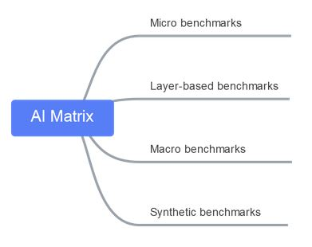

# Goals  
AI Matrix is a benchmark suite for testing AI software frameworks and hardware platforms. It aims at providing users a means of measuring the performance of different AI sofware and hardware and comparing their pros and cons. It also helps users gain insights into the factors that affect AI hardware performance and improve hardware design.

  
The AI Matrix suite consists of four categories of tests: micro benchmarks, layer-based benchmarks, macro benchmarks, and synthetic benchmarks. The testing granularity of test sub-category is increasing. Micro benchmarks focus on basic hardware level GEMM compuation which is also important to AI computation; layer-based benchmarks focus on evaluating the basic element of neural network; macro benchmarks evaluate the complete models from different application areas. Majority of the application are tested on tensorflow while CNN tests are also evaluated in caffe. Tensorflow is one of the most important framework in AI application area and it widely used in Alibaba also. Caffe is one of pioneer in the AI framework and there are still a lot of legacy models wrtitten in Caffe. Due to our limited resources, we only collect test cases from these two frameworks but in future, we will extend our collection in other frameworks.
